<h1 align="center">Привет :)👋</h1>

---

### 👨‍💻 Обо мне:
Я начинающий QA инженер, в настоящее время обучаюсь в вузе и параллельно развиваюсь в направлении QA
и тестирования веб-приложений.

Изучаю ручное и автоматизированное тестирование, осваиваю новые инструменты, каждый день стараюсь углублять свои знания. 
Сейчас я в активном поиске стажировки или любой возможности поработать в реальном проекте

📫 **Как связаться со мной:** [📧 yarrnkt@mail.ru](mailto:yarrnkt@mail.ru)
---

### 🤝 Социальные сети:

  
  

---

### 📁 Тестовая документация:

  &nbsp;
  
  &nbsp;
  
  &nbsp;
  

---

### 🛠 Тестирование веб-приложений:

  &nbsp
  
  &nbsp
  
  &nbsp
  

---

### 📱 Тестирование мобильных приложений:

  &nbsp
  
  &nbsp;
  

---

### 💾 Работа с данными:

  &nbsp
  

---

### ✏️ Работа с кодом:

  &nbsp
  
  &nbsp
  
  
  

---

### ✏️ Технологии:

  
  
  
  
  
  
  
  
  
  

---

### ⚔️ Codewars:

---

  

---

